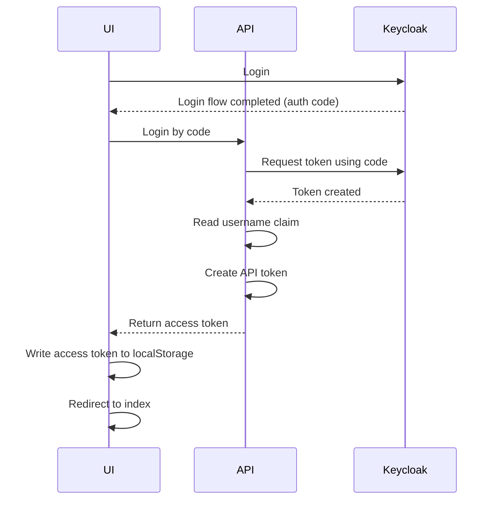

# Keycloak

This documentation covers using Keycloak with Docker in this repository.

This project only contains a sample ui and api that uses keycloak for
authentication.

Configurations provided for configuring Keycloak can be specified in the
environment, or they can also be provided in a `.conf` file in the format
`<key-with-dashes>=<value>`.

For a detailed example, see `compose.yml`.

For more information on configuration options and setup, see [All Configs].

> [!NOTE]
>
> `start` runs in production mode, `start-dev` runs in development mode

> [!WARNING]
>
> Production requires additional setup:
>
> - Don't expose HTTP port (8080) in compose file
> - Hostname configuration is required
> - HTTPS/TLS configuration is required

## Optimizations

For faster startup in containers, use the recommended flow:

1. Build once normally
2. Start with `--optimized` to reuse the build

If runtime build config conflicts with a pre-build, the pre-built assets take
precedence.

## Keycloak Administration

Keycloak creates a realm named `master` by default in first start. An admin
login is required to perform operations in this master realm. We provide these
user credentials via the environment as `KC_BOOTSTRAP_ADMIN_USERNAME` and
`KC_BOOTSTRAP_ADMIN_PASSWORD`. This user is opened as a temporary user. It is
not recommended to continue using this user.

> [!TIP]
>
> To manage keycloak, you can use cli script `kcadm.sh` in a separate docker
> service from a shell script such as `init.sh`

### Realms

Realms isolate users and configuration. The master realm is designated as the
administrator realm. If a client and a regular user are to be added, a separate
realm must be created.

To create a new realm,

1. login using the admin user under the master realm (assuming it is newly
  created, this will be the one you created with `KC_BOOTSTRAP_ADMIN_X`).
1. You can create a new realm by simply entering a `name` and selecting `enable`
  on the manage realm page, accessible from the side menu.

### Clients

After creating a realm, you automatically navigate to that realm. At this point,
clients will be created within whichever realm you are currently in.

To create a client:

1. Open the new client creation screen from the Clients tab in the side menu
1. Enter a `Client ID` and ensure that the `Client Protocol` is set to
  `openid-connect`. Then click next
1. Make sure `client authentication` is enabled, then you can click next.
1. After entering the `Root URL`, please enter `Valid redirect URIs`,
  considering the possible redirect URLs as well. It is important to note that
  after the root URL is provided, it is added to the beginning of the redirect
  URL. If the redirect URL provided for the auth code is not within the valid
  scope, it is blocked
1. Now you can save it

When API requests are sent through this client, the `client_secret` must be
provided. You can find this secret information in the credentials section of the
Clients page.

### Users

User creation can also be easily done by going to their own page. However, the
user's password is set by going to the user's page after the user is created and
doing it from the `Credentials` tab.

[All Configs]: https://www.keycloak.org/server/all-config